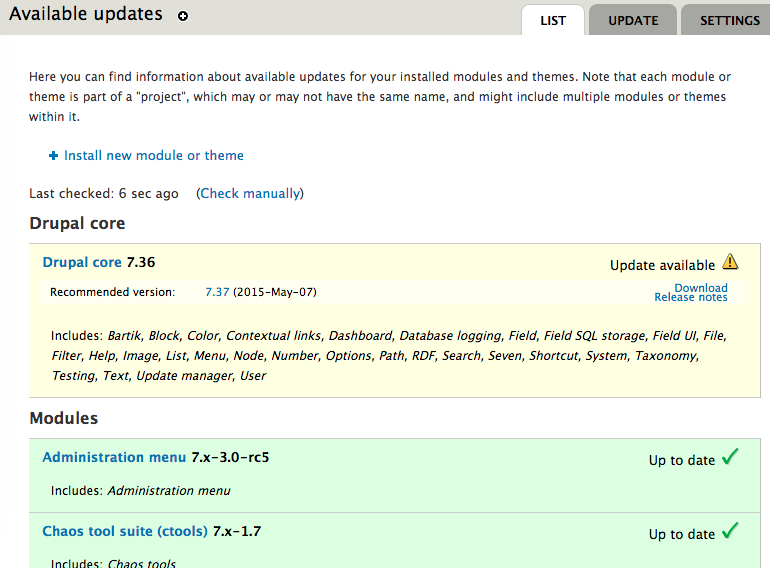
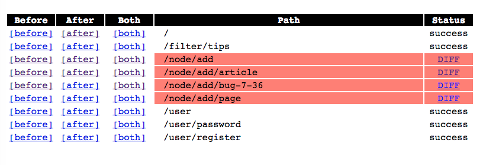

<div style="position: absolute; height: 97%; width: 100%;">
  <div style="margin:30px auto 50px 0px; width: 90%; text-align: center">
    <h2 style="font-size:1.8em; font-weight:bold;">
      Test Driven Drupal Upgrades
    </h2>
    <div style="font-size:0.7em;">
      <div style="font-size:1.2em; font-weight:bold;">Dave Vasilevsky</div>
      <div> vasi@evolvingweb.ca </div>
      <div> github.com/vasi </div>
      <div> twitter.com/djvasi </div>
      <div> drupal.org/u/vasi </div>
    </div>
  </div>

  <p></p>
</div>

--end--

## Outline

* __About me__
* __Intro__
* __Basics__
  * Minor Updates
  * Major Core Upgrades
  * Testing
* __Tools__
  * behat
  * CircleCI
  * docker
      * __drupal-docker-marriage demo__
  * PHPUnit
  * sitediff
      * __SiteDiff demo__

--end--

## About Evolving Web

* Drupal development, consulting and training since 2007
* Very involved with the Drupal community
* Specialties
  * Large, scalable infrastructure and deployments
  * Multilingual content management
  * Apache Solr search interfaces
  * Content import and synchronization
  * Custom theme development
  * Custom module development
  * Search engine optimization for Drupal (SEO)
  * Integration with legacy systems
  * Expert Drupal training
* Based in Montreal, clients in Canada and USA
* EW is hiring! So let us know if you're interested

--end--


--end--

## Drupal training program


* Public: Montreal, Ottawa, Toronto, DC, Munich, NJ, NYC, Boston, Chicago
* Private: Health Canada, Parks Canada, Tourism Quebec, Trent U, McGill U
* Enterprise teams, dev shops, remote

--end--

## About me

* I've been at Evolving Web since 2008, taught my coworkers about version control
  * Working with Drupal since D6
* Participate in lots of open source projects: Fink, Firefox, grub, pixz, and of course Drupal core!

--end--

## Introduction

* Upgrades are important for security
  * Security bugs are constantly found in Drupal and Drupal modules
  * Eg: Drupalgeddon (SA-CORE-2014-005) fixed in 7.32
* Upgrades bring new features
  * Drupal 7 has many performance improving features over D6
  * Webform 4 brings token support
* Drupal 6 is now EOL! No more security fixes

--end--

## Introduction

* Many Drupal developers aren't great at upgrading. Why?
  * Not everyone knows how
  * It can take time
  * We're afraid of regressions
  * We hate manual testing

--end--

## How to change

* Learn how to do upgrades
* Good tools make it easier and faster
* Testing makes it safe

--end--

## Minor updates vs. major upgrades

* Minor updates: 7.35 -> 7.36
  * Modules need updates too!
  * Perform these as often as possible, to keep up with security
* Major upgrades: 6.28 -> 8.0.5
  * Brings many, many new features and opportunities
  * Necessary before D6 is obsolute

--end--

## Minor update basics

* When to update: Use the Drupal Security Advisories mailing list: https://www.drupal.org/security
  * Or use the update module
* Where to update: In staging
  * Never do an update for the first time in production, you don't know if anything will break
* Watch out for hacks or patches to your modules!
  * Use the ```hacked``` module to find them



--end--

## Minor update basics

* How to update in place:
  * ```drush pm-updatestatus``` to list available updates
  * ```drush pm-update``` to perform updates
* For real sites in production:
  * Perform manual update on dev/staging, test
  * Commit
  * Deploy to staging and test
  * Deploy on prod
* Update hooks
  * Keep database in sync with versions of code
  * Eg: new column in database; rename variable
  * Running them: ```update.php``` or ```drush updb```

--end--

## Major upgrade basics

...

--end--

## Major upgrade basics

The first rule of major upgrades is there is no such thing as a basic major upgrade.

--end--

## Major upgrade basics

* Major upgrades can be as hard as a site rebuild
  * Change in ways that aren't backwards-compatible, especially D7 -> D8
  * Modules may not be updated yet, or at all

--end--

## Major upgrades, the old way

You might still want to do D6 to D7 upgrades:

* Avoid EOL
* Can perform the update in-place
* Your custom modules might need only small fixes

--end--

## Major upgrades, the old way

In D6:

* Update core and contrib to latest D6 version
* Minimize the site: disable custom theme, modules, some contrib

Do the upgrade:

* Update core and contrib code to highest D7 version
* Run `drush updb`
* Use content_migrate to move from CCK to fields
* Upgrade and re-enable modules
* Fix all the breakage! Lots of ways things can go wrong

--end--

## Major upgrades, D8

No more in-place upgrades!

* Build your brand new D8 site
  * Can't keep your custom modules or theme
* Migrate content from your existing D6 or D7 site

--end--

## Major upgrades, D8

For a simple site, it's easy:

* Create an empty D8 site
* Install migrate_upgrade from contrib
* Visit `/upgrade', tell it how to connect to your D6/D7 database
* Go!

All your settings and content will be pulled into D8! But still...

* A lot of things aren't working quite yet, eg: multilingual content
* Have to rebuild custom modules and themes
* Contrib modules you used to use may not be ready, eg: panels

--end--

## Major upgrades, D8

For a more complex site, you might just want to do a full site rebuild.

* Build a nice new site from scratch, you'll like D8!
* But still get some of the content from D6/D7
  * Run `drush migrate-upgrade --configure` to configure upgrade migrations without running them
  * Then edit/remove migrate config files as desired, so only the things you want are migrated
  * Use `drush migrate-import` from migrate_tools to execute the migrations

--end--

## Testing basics

* Unit testing
* Integration testing
* UI testing
* Continuous integration

--end--

## Unit testing

* Fast, good for standalone functions
* Use fixtures for testing
* D7: SimpleTest (DrupalUnitTestCase)
* D8: PHPUnit
* Contrib module's unit tests won't help you much for updates
* Good for custom modules

--end--

## Integration testing

* SimpleTest (DrupalWebTestCase)
* Powerful Drupal integration: Enable modules, create content, add users...
* By default, tests your module in isolation
  * Or tight coupling, hard to maintain
* Much slower, needs to site-install for each test
* Can't test things like JavaScript, CSS

--end--

## UI testing

* Tests your site by controlling a real browser
* Very powerful and thorough
* Eg: Selenium, CasperJS, behat
* Great replacement for manual testing

--end--

## Behat

[behat](http://docs.behat.org) and its [Drupal extension](https://behat-drupal-extension.readthedocs.org)

* Why BDD?
  * Testing will be ready for upgrades!
* Why use behat?
  * UI testing
  * Drupal integration
  * Easily understood tests

--end--

## behat scenarios

Here's an example of a test for behat:

    Scenario: Show author on hover
      Given I am viewing an "article" content:
      | title | author          | body  |
      | Lorem | bob@example.com | Ipsum |
      When I hover over the "author" region
      Then I should see the text "Bob"

Here's how we implemented the "hover" rule above, in a custom behat context:

    /**
      * @When I hover over the :region region
      */
    public function iHoverOverRegion($region) {
      getRegion($region)->mouseOver();
    }

--end--

## behat stack

<pre class="nocode" style="font-size: 30px;">
Behat's Gherkin language
Behat PHP contexts ---
Mink                 | Drupal extension drivers
Selenium
Chrome
</pre>

--end--

## CI

* Tests can be slow
* It's easy to forget to run them
* **Continuous integration**
  * Run your tests automatically for every commit
  * Usually uses a build server
  * Reports on the results
  * For upgrades, best with Test-Driven Development

--end--

## CircleCI

We use [CircleCI](http://circleci.com) for our continuous integration:

* Integrates with GitHub branches and pull requests
* Email notifications when something breaks
* Catches very unexpected bugs, eg: servers disappearing, unmaintained packages
* Allows use of docker, so test environment is consistent with dev/prod

--end--

## Docker

* Easily build and run virtualized containers
* Easy to spin up an exact copy of your site
  * If something breaks, just spin it up again
  * This is very useful for minor updates!
* Consistent environment in dev/staging/prod

--end--

## CircleCI & Docker

CircleCI is configured with a circle.yml file:

<pre class="prettyprint lang-yaml">
machine:
  services:
    - docker

dependencies:
  override:
    - docker build -t myproject .
    - docker run -p 9022:22 myproject

test:
  override:
    - "ssh -p 9022 drupal@localhost 'cd /var/www && drush test-run'"
</pre>

--end--

## Behat, CircleCI, Docker demo


[github.com/evolvingweb/drupal-docker-marriage](https://github.com/evolvingweb/drupal-docker-marriage)

[Demo notes](https://github.com/dergachev/presentations/blob/gh-pages/drupalcon-la-upgrades/demo-marriage.md)

--end--


--end--

## Docker

* Dockerfile build process:
* Starts with clean Ubuntu image
* Bash-like
  * Installs all necessary packages: tomcat, solr, nginx, xhprof, xdebug, ...
  * Runs our deploy scripts
* Caching
* Caveats (Makefiles, Linux, TIMTOWTDI)

--end--

## Testing requirements

* Ensure dev mirrors prod
* Ensure D6 refactoring changed nothing
* D7 should mostly mirror D6
* Mostly static HTML content
* Too big to test manually

--end--

## SiteDiff

[github.com/evolvingweb/sitediff](https://github.com/evolvingweb/sitediff)

* Downloads subset of pages from _before_ and _after_
* Computes diff of HTML
* Cleans up spurious changes, like absolute domains
* Reports changes via command-line UI and web report
* Break down huge upgrade into simple tasks

--end--

## SiteDiff configuration

<pre class="prettyprint lang-yaml">
before_url: http://docker:9179
after_url: http://docker:9180
paths:
- /
- /about-us
- /user/3/track
sanitization:
- pattern: http:\/\/[a-zA-Z0-9.:-]+
  substitute: __domain__
</pre>

--end--

## SiteDiff output


--end--

## SiteDiff

* Advantages:
  * Thoroughness
  * Black-box
  * Speed
* Limitations:
  * JavaScript
  * Dynamic content
  * Admin UI

--end--

## SiteDiff

SiteDiff turns out to be useful on many projects

* Refactorings
* Dev vs Prod
* Content migration
* Upgrades! Little should change

--end--

## SiteDiff demo



[github.com/vasi/sitediff-update-demo](https://github.com/vasi/sitediff-update-demo)

[Demo notes](https://github.com/dergachev/presentations/blob/gh-pages/drupalcon-la-upgrades/demo-sitediff.md)

--end--

## Any questions?

* Evolving Web: [evolvingweb.ca](http://evolvingweb.ca)
* SiteDiff: [github.com/evolvingweb/sitediff](https://github.com/evolvingweb/sitediff)
* Demo of SiteDiff: [github.com/vasi/sitediff-update-demo](https://github.com/vasi/sitediff-update-demo)
* Demo of docker, behat, CircleCI: [github.com/evolvingweb/drupal-docker-marriage](https://github.com/evolvingweb/drupal-docker-marriage)
